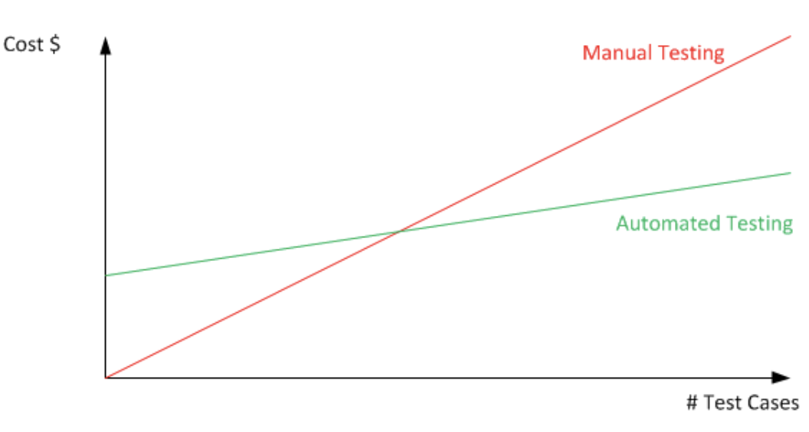

# Tests automatisés

## Principes & mise en application (TypeScript, Node.js, Jest, React Testing Library)

Arnaud Renaud

---

<!-- Pré-requis pour la pratique : JavaScript, TypeScript, bases de données relationnelles, interfaces utilisateur à état (React) -->

<!-- Objectif : créer une application qui affiche les prévisions météo -->
<!-- Première note : contrôle continu de la participation -->
<!-- Deuxième note : projet par deux (web app React, serveur Express TypeORM) -->

<!-- Exercice : dans un fichier JS, implémenter une fonction `getShippingCost` qui retourne les frais de port en fonction du poids total de la commande (10 euros par kg) -->

<!-- ```js
const articlesExample = [
  { id: "1234", priceEur: 40, weightKg: 0.3, quantity: 2 },
  { id: "5678", priceEur: 20, weightKg: 0.1, quantity: 5 },
];
``` -->

<!-- Exécuter la fonction pour vérifier son résultat -->

<!-- Ajouter une règle : frais de port offerts si le prix total des articles est supérieur ou égal à 100 euros -->

<!-- Ajouter une règle : si des articles ont des frais de port spécifiques (`specialShippingCost`), ne pas les compter dans le poids total mais ajouter leurs frais de port spécifiques aux frais de port par poids -->

# Pourquoi automatiser les tests ?

**Une application devient rapidement trop complexe pour jongler mentalement entre tous ses cas d'usage.**

---

<!-- Exercice : initialisation d'un projet NPM, installation de Jest, écriture des spécifications -->

# Batterie de tests automatisés

Système de gestion de la complexité :

- Décharge mentale pour le développeur
- Garantie du fonctionnement d'une application complexe
- Spécifications intégrées et vérifiées automatiquement
- Ne nécessite pas d'interface

---



---

# Quels cas tester ? Où s'arrêter ?

Un tableau vide ? _null_ ? _undefined_ ?

- Se limiter aux cas réalistes
- Restreindre les cas en typant les paramètres

<!-- Live coding : installation de TS, configuration de Jest pour ne pas exécuter les tests en double -->

---

<!-- Exercice : implémenter une fonction `getOrderCost` qui une commande en paramètre et retourne non seulement les frais de port, mais aussi le prix total sans et avec les frais de port. Quels cas tester ? -->

# Périmètres de test

- Tests unitaires
- Tests d'intégration
- Tests de bout en bout

---

## Tests unitaires

Contrôle du comportement d'un composant isolé (fonction ou méthode) dans différents cas d'usage.

Ici, on ne teste pas le comportement de ses dépendances internes.

_Exemple : tester un algorithme de calcul._

---

## Tests d'intégration

Contrôle du comportement d'une chaîne de composants.

Ici, on teste le comportement des dépendances internes concernées.

_Exemple : vérifier qu'une méthode produit la bonne écriture en base de données._

---

## Tests de bout en bout

Contrôle du comportement de la chaîne complète des composants d'une fonctionnalité de l'application.

Ici, on se place du point de vue de l'utilisateur, sans importer de code dans les tests.

_Exemple : en soumettant un formulaire web, vérifier que le bon message de succès ou d'erreur est affiché à l'utilisateur._

---

## Tests unitaires


---

## Tests d'intégration


---

## Tests de bout en bout


---

## Tests d'intégration et de bout en bout : jusqu'où aller ?

⚠️ Ne pas tester tous les cas : c'est la prérogative des tests unitaires, qui sont les plus précis.

---

## Pyramide des tests


---

# Fonctions pures et impures, environnement réel ou simulé

---

## Fonction pure

Une fonction pure n'a pas d'effet de bord : elle ne change aucun état, se contente de retourner un résultat qui dépend de ses paramètres d'entrée.

_Exemple : un algorithme de calcul._

Tester une fonction pure revient à contrôler sa valeur de retour.

---

<!-- Live coding : présenter le modèle relationnel qui permettra d'utiliser TypeORM : Order, Article, ArticleInOrder : modifier type Article pour déplacer la quantité dans ArticleInOrder; déclarer un tableau d'ARTICLES qui fait office de base de données -->

<!-- Exercice : implémenter et tester une méthode statique create qui prend en paramètres un tableau d'ArticleInOrder et retourne un objet Order -->

<!-- Exercice : implémenter et tester la méthode d'instance confirm qui doit passer isConfirmed à true (fonction impure qui modifie son environnement) -->

## Fonction impure

Une fonction impure a des effets de bord : elle modifie l'état environnant.

_Exemple : envoyer un email ou modifier l'état d'un objet._

Pour tester une fonction impure, il faut contrôler l'état des objets appelés ou modifiés.

<!-- Livecoding : ajouter une fonction sendEmail fictive qui prend en argument un message (string) et qui affiche un message d'avertissement (autre fonction impure) -->

<!-- Exercice : modifier les tests de la méthode confirm pour vérifier que la fonction sendEmail est bien appelée, mais ne pas l'appeler réellement (utiliser un mock) -->

<!-- Exercice : tester que, si la fonction sendEmail émet une erreur, elle ne fasse pas échouer la méthode confirm -->

---

## Environnement réel ou simulé ?

Si l'on contrôle l'environnement, on peut l'utiliser réellement pour le mettre dans différents cas.

_Exemple : une base de données._

Sinon, on le remplace par une simulation (un bouchon, ou _mock_) : cela permet d'avancer dans les tests même si le service n'est pas implémenté.

_Exemple : une API externe (simuler sa réponse en succès ou en erreur)._

<!-- Live coding : mettre en place TypeORM (base SQLite en mémoire initialisée dans les tests), remise à zéro après chaque test -->

<!-- Exercice : mettre à jour les tests de `static create` et de `confirm` : la persistance en BDD doit être testée ; corriger les autres tests -->

---

# Pratiques de test

---

## Test-driven development (TDD)

Écrire d'abord les tests, puis les laisser nous guider dans l'implémentation.

- L'interface (entrées et sorties) doit être clairement définie à l'avance
- Adapté en cas d'implémentation difficile avec des cas nombreux (quand on ne sait pas par où commencer l'implémentation)

<!-- Exercice : écrire un test qui spécifie que la méthode create doit échouer si on lui passe un tableau vide, puis implémenter le comportement -->

---

## Couverture de tests

Statistiques donnant une vue d'ensemble sur la proportion de nos fonctions et méthodes testées, et si tous leurs chemins sont parcourus par les tests.

<!-- Côté client (React) : afficher la liste des articles avec, pour chaque article, la quantité (initialement zéro), un bouton +, un bouton - ; à la soumission, créer une commande avec les articles et leur quantité -->

<!-- Fonctionnalités pour le rendu de projet : https://github.com/arnaudrenaud/typescript-testing-course-livecoding/issues -->
